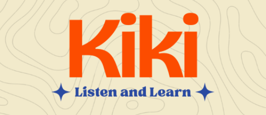
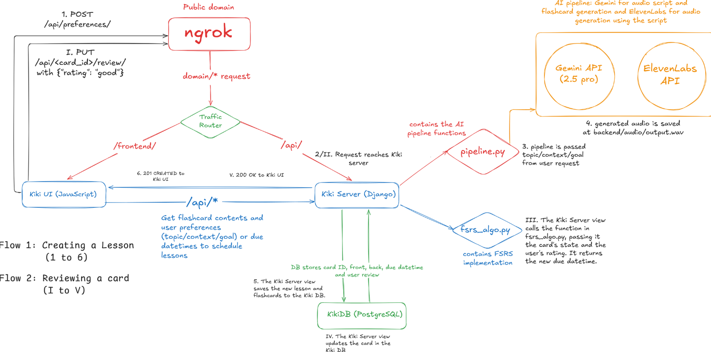

<div align="center">
  
</div>

<h1 align="center">kiki</h1>
<p align="center">As presented at the Youth Coders Collective Hackathon, <a href="https://devpost.com/software/kiki-5i6u7v">details</a></p>

## Inspiration
I have been an Anki user for quite a while now. It's gotten me through countless hurdles I have faced in my academic life. I have also been fascinated by the algorithm that powers Anki and how effectively it helps to lock in knowledge.

As a sophomore, my commute and gym time add up. While I could technically review Anki cards then, pulling out my phone for flashcards feels like effort when I'd much rather just listen to music or a podcast This, to me, was a missed opportunity. What if that time could be used to learn effectively, like I did with Anki?

That was the idea behind Kiki. Kiki combines the Japanese verb for listening, 'kiku' (聞く) with the memorization power of Anki (暗記). It aims to fuse the convenience of audio learning with the proven science of spaced repetition, turning those passive listening hours into truly productive study sessions.

## Architecture
<div align="center">
  
</div>

## Built with
Kiki's backend was built using Python (Django), where I utilised the Django REST Framework (DRF) to handle the API endpoints. The database used was PostgreSQL, which is an industry-standard for structured data and also pairs well with Django's inbuilt ORM. The frontend is crafted with vanilla HTML, CSS and JavaScript to function on a minimal and functional user experience. For the AI pipeline, I integrated the Google Gemini API (2.5 pro model) to generate both the personalized audio lesson scripts and the flashcard content. The prompt was fine-tuned to ensure quality and relevance. The text-to-speech conversion leverages the ElevenLabs API for its natural sounding non-robotic voices. The crucial spaced repetition scheduling is powered by an implementation of the FSRS (Free Spaced Repetition Scheduler) in Python within the backend.

## Demo
Demo video for the core loop behind the application.
[](https://www.canva.com/design/DAG2vR0i-6U/M-TsH9sK_Jt6wJgXUgeAng/view?utlId=hb63e8e4be8#10)

## Built with
Kiki's backend was built using Python (Django), where I utilised the Django REST Framework (DRF) to handle the API endpoints. The database used was PostgreSQL, which is an industry-standard for structured data and also pairs well with Django's inbuilt ORM. The frontend is crafted with vanilla HTML, CSS and JavaScript to function on a minimal and functional user experience. For the AI pipeline, I integrated the Google Gemini API (2.5 pro model) to generate both the personalized audio lesson scripts and the flashcard content. The prompt was fine-tuned to ensure quality and relevance. The text-to-speech conversion leverages the ElevenLabs API for its natural sounding non-robotic voices. The crucial spaced repetition scheduling is powered by an implementation of the FSRS (Free Spaced Repetition Scheduler) in Python within the backend.

## Local development setup 
To get the backend for the project running you need to first have some environment variables set up. Follow the below steps to do that.
We are assuming that you are in the root directory.

**Part A: Environment variables**
1. First, create a `.env` file in the below folder:
    ```bash
    cd backend/kiki/
    touch .env
    ```
2. Now get your Google Gemini API Key from Google's AI Playground. Also get your ElevenLabs API key from the ElevenLabs website. Add both as environment variables:
    ```env
    ELEVENLABS_API_KEY=sk_...
    GEMINI_API_KEY=AI...
    ```
You are done now!

**Part B: Getting the backend to run**
1. First, we need to install the requirements.
    ```bash
    cd backend
    uv venv # create a virtual environment
    source .venv/bin/activate  # On Windows use: .venv\Scripts\activate
    uv pip install -r requirements.txt
    ```
2. Next, some database migrations need to be made.
    ```bash
    cd kiki
    python manage.py migrate
    ```
3. Now we can create a superuser to log into the admin panel (`/mothership` here).  
    ```bash
    # inside backend/kiki/
    python manage.py createsuperuser
    ```
4. Lastly, we can use Django to start a server at the default port (or specify a port).
    ```bash
    python manage.py runserver
    ```
The server should now be running at `http://localhost:8000/`.

**Part C: Getting the user interface to run**

No build step is needed here as the frontend is made with a decoupled Vanilla JavaScript/HTML setup.
1. First, change into the frontend folder
    ```bash
    cd frontend
    ```
2. Now you can serve the files using any local server; we use Python's builtin server here.
    ```bash
    python -m http.server 5500
    ```
You should now be able to access the user interface at `http://localhost:5500`.

## Challenges
1. Integrating and understanding the FSRS algorithm's logic for scheduling was a significant hurdle, requiring careful thought to correctly calculate review intervals based on user feedback and updating the database to include the new due datetime.
2. ElevenLabs API had a strict limit on free tier usage which made it difficult to test the application. This limitation could pose challenges in the future as well.
3. One of the primary challenges was ensuring that the AI-generated audio lessons were engaging and not robotic, while also maintaining technical accuracy without dumbing down complex topics to ensure users of all knowledge levels can use the product to their liking. This required careful engineering of prompts given to Gemini.

## Learnings
This project was a deep dive into full-stack development. I significantly improved my skills in backend development with Django, API design, managing external API integrations, and also in frontend development for creating the user interface. I also gained some valuable practical experience integrating a complex algorithm like FSRS and understanding its underlying principles. It was a fantastic learning experience that provided insight into how modern spaced repetition systems (like Anki) function.

## Current status
Kiki was a passion project created for a hackathon. As such, it served as a proof-of-concept of things that could be accomplished using the current generation of large language models. This is the reason that this repository is not actively maintained. You may check out the demo video from above to see it in action.
